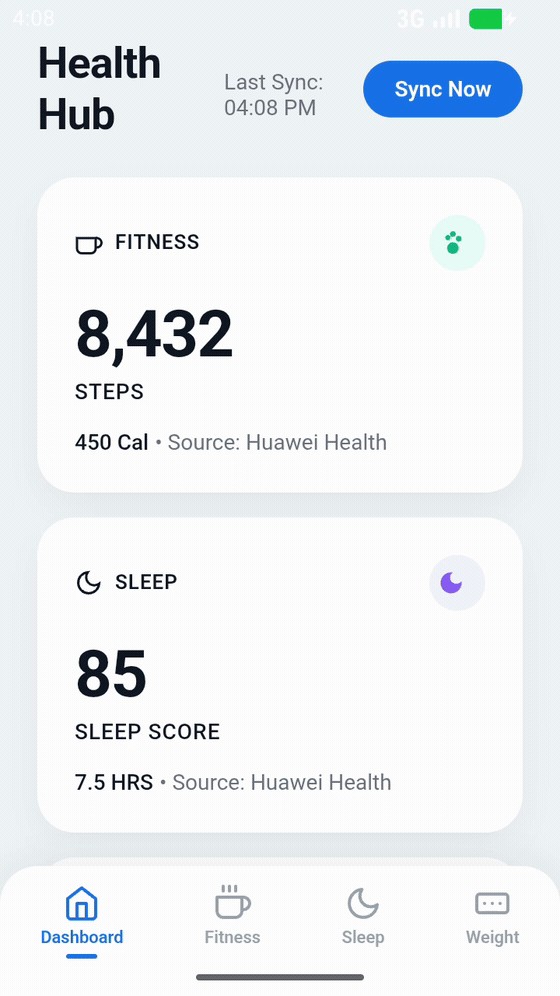
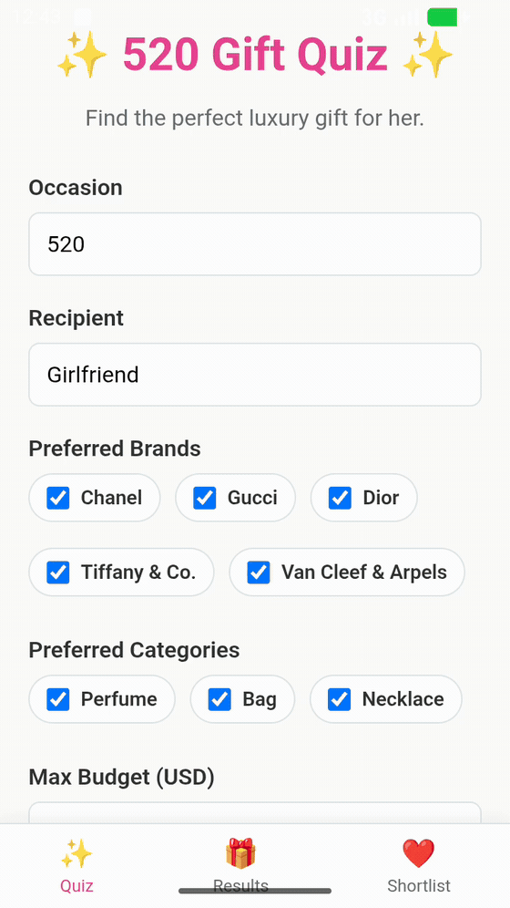
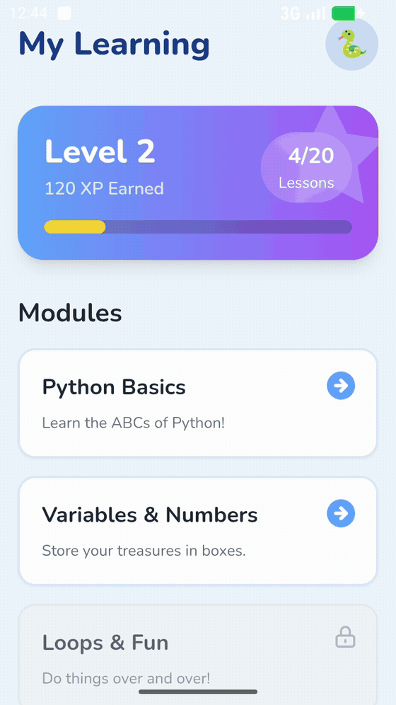
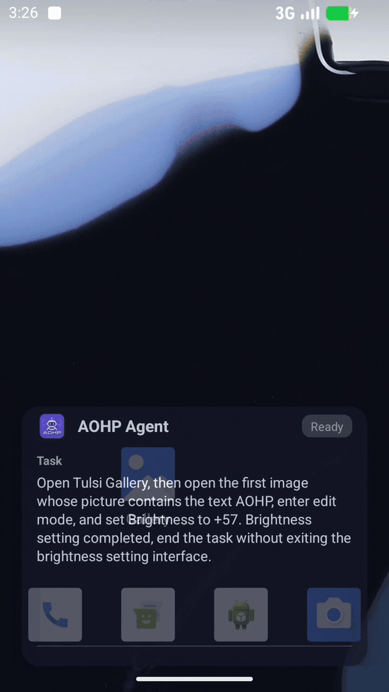
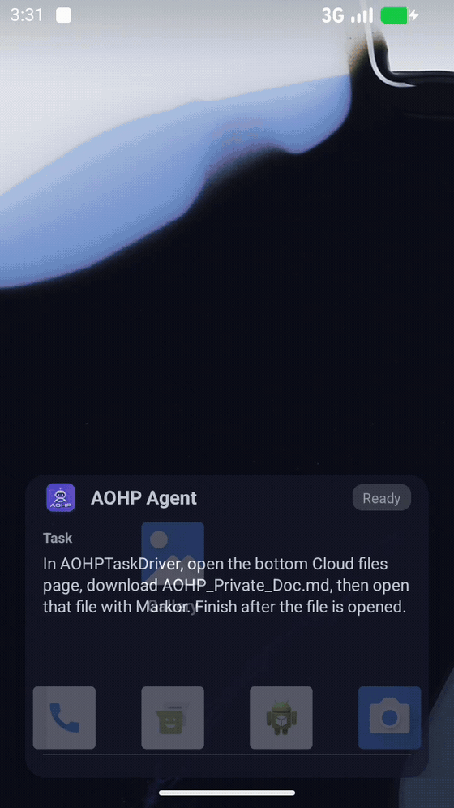
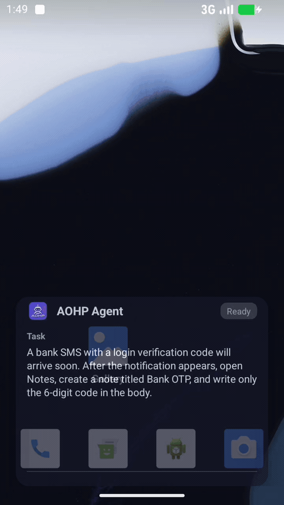

<h1 align="center">AOHP: Android Open Harness Project</h1>

<p align="center">
  <strong>Let the OS proactively adapt to its user via agentic AI.</strong>
</p>


<p align="center">
  <a href="#real-world-demos"></a>
  <a href="https://arxiv.org/abs/2606.23449"></a>
  <a href="LICENSE"></a>
</p>
<p align="center">
  <a href="https://github.com/MobileLLM/lab-contact"></a>
  <a href="https://discord.gg/3bhPrAarW"></a>
  <a href="https://x.com/yuanchun_li/status/2069293026577629298"></a>
</p>

<p align="center">
  <a href="docs/README.zh-CN.md">中文文档</a> ·
  <a href="docs/DEVELOPMENT.md">Development Guide</a> ·
  <a href="docs/DEVELOPMENT.zh-CN.md">开发指南</a>
</p>
<strong>🎬 <a href="#real-world-demos">See Demos</a></strong>: Watch AOHP generate personalized user-defined apps and complete cross-app tasks.

---

## Why AOHP?

Traditional OS puts apps at the center. Users navigate **developer-defined app interfaces** to do everything, which may be tedious and distracting.

AOHP shifts the OS toward deeper personalization.
It introduces **user-defined apps**, which are generated based on the user's actual needs and are backed by AI agents under the hood.
The agents use system APIs, CLIs and GUI-based apps in the background to compose actual services.

To make such experience **feasible, efficient and secure**. Many components in the system and framework layers have to be redesigned, but not all. That's why we introduce AOHP, an OS-level agent harness to enable personalized, efficient and secure interaction.

<p align="center">
  
</p>


> [!IMPORTANT]
> **AOHP is an early-stage research prototype**.
> It is not ready for production deployments or security-critical workloads.
>
> We will keep improving the reliability, compatibility, and security coverage.
> Feedback and contributions are welcome.

---

## Design

AOHP features a set of efficient agent interfaces and a secure information flow tracking mechanism, which together foster the core capabilities to enable personalized service composition. The system architecture:

<p align="center">
  
</p>

A comparison between AOHP and stock Android:

| Dimension               | Stock Android                                                 | AOHP                                                          |
| ----------------------- | ------------------------------------------------------------- | ------------------------------------------------------------- |
| **Interaction Model**   | Users operate app-defined workflows directly                  | Agents act as first-class OS actors under user intent         |
| **Interaction Surface** | Fixed app GUIs defined by developers                          | Personalized service entrances mediated by agents             |
| **Process Execution**   | Single-tenant foreground execution bound to physical displays | Parallel background interaction decoupled from the screen     |
| **System Memory**       | Fragmented and locked inside individual applications          | OS-managed cross-app memory for task personalization          |
| **Security & Privacy**  | Coarse-grained app permissions and opaque data flows          | Fine-grained data-flow tracking and sandboxed sensitive values|


---

<a id="real-world-demos"></a>

## 🎬 Demos

AOHP ships as a runnable AOSP fork.
The recordings below come from the compiled system image.

### User-Defined Apps

Given a natural-language prompt, AOHP produces a fully-functional app, including the frontend UI and background logic supported by agents.

<table align="center">
<tr>
<td align="center" width="33%"><strong>Health Hub</strong><br><sub>Unified Fitness & Sleep Dashboard</sub></td>
<td align="center" width="33%"><strong>Gift Picker</strong><br><sub>Luxury Gift Recommendation for 520</sub></td>
<td align="center" width="33%"><strong>Python Learning Assistant</strong><br><sub>Kid-Friendly Programming Tutor</sub></td>
</tr>
<tr>
<td align="center"><a href="./demos/uda/health_hub_demo.mp4"></a></td>
<td align="center"><a href="./demos/uda/gift_picker_demo.mp4"></a></td>
<td align="center"><a href="./demos/uda/python_learning_assistant_demo.mp4"></a></td>
</tr>
<tr>
<td align="center"><sub>Aggregate fitness, sleep, and weight records from different apps into a unified health management app.</sub></td>
<td align="center"><sub>Generate a luxury gift selection app for my anniversity. Find gift information from all shopping apps.</sub></td>
<td align="center"><sub>Generate a Python learning app for my child. Include courses and exercises. Track progress and report to me via messages every day.</sub></td>
</tr>
</table>

### Agent Execution

AOHP provides personalized services by orchestrating APIs, CLIs, GUIs, memory, skills, etc. with AI agents.

<table align="center">
<tr>
<td align="center" width="33%"><strong>UI Micro-operations</strong></td>
<td align="center" width="33%"><strong>File Handling</strong></td>
<td align="center" width="33%"><strong>Event Capture</strong></td>
</tr>
<tr>
<td align="center"><a href="./demos/agent/gallery_brightness.mp4"></a></td>
<td align="center"><a href="./demos/agent/cloud_file_markor.mp4"></a></td>
<td align="center"><a href="./demos/agent/event_capture.mp4"></a></td>
</tr>
</table>

---

## Evaluation Highlights

We evaluate AOHP with [OpenClaw](https://github.com/openclaw/openclaw) against stock Android.
The benchmark has 30 real-world mobile tasks.
They cover GUI operation, non-GUI operation, event capture, multi-source retrieval, memory management, and hybrid workflows.

### Task Completion

Each task is scored by objective checkpoints, so partially completed tasks still receive partial credit.

| Setting | Completion Rate | Fully Solved | Partially Completed |
| ------- | --------------- | ------------ | ------------------- |
| OpenClaw on stock Android | 54.44% | 13 / 30 | 7 / 30 |
| OpenClaw on AOHP | **75.56%** | **20 / 30** | 5 / 30 |
| Gain | **+21.12%** | **+7 tasks** | - |


### Execution Cost

To compare cost fairly, we report the 11 tasks that both systems solve completely.

| Setting | Tool Calls | Duration | Tokens | LLM Requests |
| ------- | ---------- | -------- | ------ | ------------ |
| OpenClaw on stock Android | 233 | 33.94 min | 7.10M | 273 |
| OpenClaw on AOHP | **129** | **18.93 min** | **3.44M** | **143** |
| Reduction | **44.64%** | **44.21%** | **51.55%** | **47.62%** |

### Information-Flow Security

AOHP is also evaluated with security-oriented test cases.
The system enforces all five policy cases:

| Security Check | Result |
| -------------- | ------ |
| Sensitive display uses vault references, not plaintext | Pass |
| Ordinary non-sensitive actions proceed without extra approval | Pass |
| Sensitive transfers and payment confirmation require user consent | Pass |
| Unsupported access fails closed | Pass |
| Sensitive events are redacted and preserve taint metadata | Pass |

---

## Getting Started

AOHP is built on AOSP. This repository hosts project documentation and the unified development framework.
Source trees live in the `aohp-os` GitHub organization and are pulled in via [local_manifests](https://github.com/aohp-os/local_manifests).

### Quick start

```bash
# 1. Clone the dev framework
git clone git@github.com:aohp-os/aohp.git
cd aohp

# 2. Initialize AOSP + AOHP manifests (Android 16 QPR2; see guide for mirror/proxy options)
cd AOSP && repo init -b android16-qpr2-release
cd .repo && git clone git@github.com:aohp-os/local_manifests.git && cd ..
repo sync -j4

# 3. Build
bash scripts/build.sh

# 4. Launch Cuttlefish (after envsetup + lunch)
source AOSP/build/envsetup.sh
lunch aosp_cf_x86_64_phone_aohp-trunk_staging-userdebug
sudo -E bash -c 'ulimit -n 65536; '"$ANDROID_HOST_OUT"'/bin/launch_cvd --report_anonymous_usage_stats=n' &
```

Open the emulator at **https://localhost:8443/**.

### Full development guide

Setup, networking, multi-instance Cuttlefish, sandbox options, and contribution workflow are documented in **[Development Guide](docs/DEVELOPMENT.md)**.

You can also clone this repo for project overview and updates:

```bash
git clone https://github.com/aohp-os/aohp.git
```

---

## License

AOHP is licensed under the [Apache License, Version 2.0](LICENSE).

---

## Citation

```bibtex
@misc{zhao2026aohp,
      title={AOHP: An Open-Source OS-Level Agent Harness for Personalized, Efficient and Secure Interaction}, 
      author={Shanhui Zhao and Jiacheng Liu and Guohong Liu and Jichao Yan and Jialei Ye and Yuhao Yang and Hao Wen and Shizuo Tian and Yizhen Yuan and Yuxuan Chen and Yunxin Liu and Ju Ren and Ya-Qin Zhang and Chao Huang and Yao Guo and Yuanchun Li},
      year={2026},
      eprint={2606.23449},
      archivePrefix={arXiv},
      primaryClass={cs.AI},
      url={https://arxiv.org/abs/2606.23449}, 
}
```

---

<p align="center">
  <i>The OS is no longer only a substrate for human-operated applications — it becomes the environment in which agents perceive, plan, act, and enforce user intent.</i>
</p>
